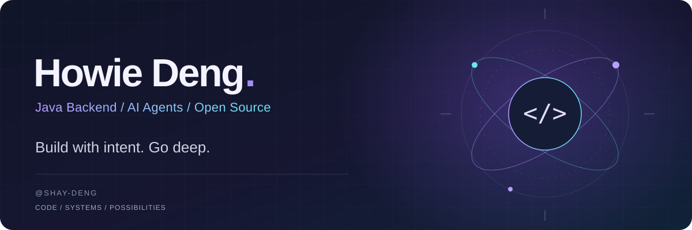

  

  <a href="https://github.com/Shay-Deng?tab=repositories">Repositories</a> &nbsp; / &nbsp;
  <a href="https://github.com/langchain4j/langchain4j-community/pull/792">Latest contribution</a> &nbsp; / &nbsp;
  <a href="https://twitter.com/ShayDeng">Connect on X</a>

 

### A little context

I'm **Howie**, studying computer science at **NYU**. My current focus is **Java and AI infrastructure**, with a particular interest in how systems behave at the edges: streaming, cancellation, concurrency, and failure handling.

  
  
  
  
  

 

### In the code

<table>
<tr><td>
 
<strong>01 &nbsp; / &nbsp; LANGCHAIN4J COMMUNITY</strong>
<h3>Making streaming failure handling predictable.</h3>

A proposed fix for <code>StreamingModelRouter</code>: invalid demand should signal an error, cancel upstream work, and terminate exactly once.

<code>Reactive Streams</code> &nbsp; <code>Concurrency</code> &nbsp; <code>Regression tests</code>

The change covers late subscriptions, reentrant requests, and ordering between in-flight callbacks and terminal signals.

<a href="https://github.com/langchain4j/langchain4j-community/pull/792"><strong>Read the pull request →</strong></a> &nbsp; · &nbsp; <a href="https://github.com/langchain4j/langchain4j-community/issues/791">Issue #791</a> &nbsp; · &nbsp; <a href="https://github.com/Shay-Deng/langchain4j-community/tree/fix/streaming-router-invalid-demand">Explore the code</a>

Submitted as draft PR #792 · See the linked PR for its current review status.
  
</td></tr>
</table>

 

### What I'm exploring

| Java systems | AI infrastructure | Engineering practice |
| :--- | :--- | :--- |
| Streaming & concurrency | LLM integration & routing | Focused fixes & regression tests |
| Lifecycle & cancellation | Failure handling & failover | Reading and working in public codebases |

 

---

  操千曲而后晓声，观千剑而后识器。 
  Read deeply. Build thoughtfully.

